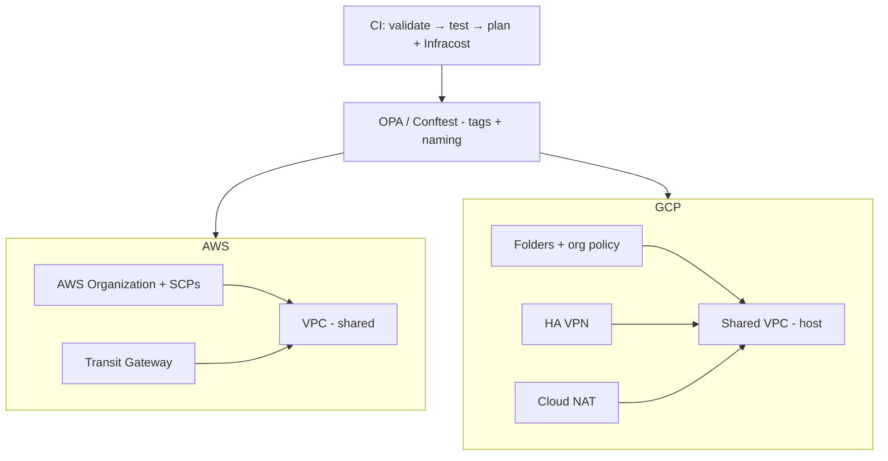
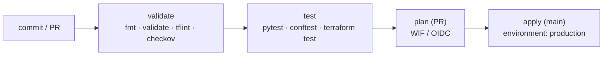
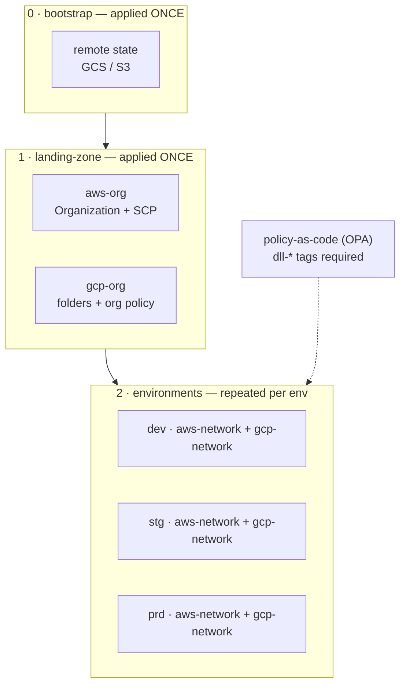

# multi-cloud-landing-zone

[](https://github.com/davidllauce/multi-cloud-landing-zone/actions/workflows/ci.yml)
[](LICENSE)
[](.terraform-version)

A production-grade **landing zone** foundation for AWS and GCP, built as a
single cloud-agnostic control plane with Terraform.

A landing zone is the organization-level foundation — identity, networking,
security, and governance — that every workload builds on. This repository
applies the same foundation across AWS and GCP.

## Architecture



The same Terraform control plane applies the foundation across both providers;
provider-specific resources are used only where the clouds genuinely differ.

## Prerequisites

| Tool | Purpose |
|---|---|
| [`tenv`](https://github.com/tofuutils/tenv) | Terraform version manager (`tenv tf install 1.9.8`) |
| [`uv`](https://github.com/astral-sh/uv) | Python environments |
| [`task`](https://taskfile.dev/) | Task runner |
| `tflint` | Terraform lint |
| `conftest` / `opa` | Policy-as-code (optional, used in CI) |
| [LocalStack](https://localstack.cloud/) | AWS emulation for local runs |
| GCP emulators | BigQuery / Pub/Sub / etc. for local runs |

## Replicate locally

Everything below runs with no cloud credentials (`validate`, `test`, and
`plan` are dry-run). Install the toolchain once, then run the steps in order:

1. **Install Terraform via tenv**
   ```bash
   tenv tf install 1.9.8
   ```
2. **Bootstrap the repo** (Python env + pre-commit hooks)
   ```bash
   task setup
   ```
3. **Run the full validation gate** (fmt + validate + tflint + checkov + pytest + conftest + terraform test)
   ```bash
   task check
   ```
4. **Dry-run plan** on the representative `dev` environment (no apply)
   ```bash
   task iac:plan
   ```
5. **Estimate cost** (optional, requires `INFRACOST_API_KEY`)
   ```bash
   task iac:cost
   ```

## Authentication (zero static credentials)

Cloud credentials are never stored in the repository. See
[`ADRs/ADR-003`](ADRs/ADR-003-zero-trust-credentials-wif-oidc.md).

**Local (validate / test / dry-run plan):**

```bash
gcloud auth application-default login   # GCP
export AWS_PROFILE=my-profile           # AWS

task check        # fmt + validate + tflint + pytest + conftest (no cloud access)
task iac:plan     # terraform plan (dry-run, no apply)
```

**CI (plan / apply with federated identity):**

- GCP via **Workload Identity Federation** (`google-github-actions/auth@v2`).
- AWS via **OIDC** (`aws-actions/configure-aws-credentials@v4`).
- Requires these GitHub secrets: `GCP_WIF_PROVIDER`, `GCP_SERVICE_ACCOUNT`,
  `AWS_OIDC_ROLE_ARN`. If they are not set, the `plan`/`apply` jobs are skipped.

**Applying to a real organization** requires provisioning the WIF pool/provider
(GCP) and the OIDC role (AWS); see the README "Apply order" below.

## Usage

Consume a module directly from this repository:

```hcl
module "aws_org" {
  source = "git::https://github.com/davidllauce/multi-cloud-landing-zone.git//terraform/modules/aws-org?ref=main"

  organization_root_id = "r-xxxx"
}

module "aws_network" {
  source = "git::https://github.com/davidllauce/multi-cloud-landing-zone.git//terraform/modules/aws-network?ref=main"

  environment = "dev"
  team        = "sre"
}

module "gcp_org" {
  source = "git::https://github.com/davidllauce/multi-cloud-landing-zone.git//terraform/modules/gcp-org?ref=main"

  folder_id = "folders/xxxx"
}

module "gcp_network" {
  source = "git::https://github.com/davidllauce/multi-cloud-landing-zone.git//terraform/modules/gcp-network?ref=main"

  region = "us-central1"
}
```

## Testing

Policy-as-code is enforced by OPA/Conftest (see `ADRs/ADR-001`). Run it locally:

```bash
task iac:policy   # conftest test tests/fixtures/plan_valid.json
task test         # pytest (includes policy checks)
```

## CI pipeline



- `validate` + `test` run on every PR and push; `plan` runs on PRs; `apply` runs only on `main`, gated behind the `production` environment.
- `plan`/`apply` authenticate via **federated identity** (GCP WIF + AWS OIDC) and are skipped when no cloud secrets are configured.

## Project layout

```text
terraform/
├── modules/                    # reusable, stateless modules
│   ├── aws-org/                # AWS Organizations + SCP (org level, once)
│   ├── aws-network/            # VPC, subnets, Transit Gateway (per env)
│   ├── gcp-org/                # folders (org level, once)
│   ├── gcp-network/            # Shared VPC, HA VPN, Cloud NAT (per env)
│   ├── policy/                 # OPA policies (tags + naming)
│   └── backend/                # remote state (S3 / GCS)
├── 0-bootstrap/                # state buckets (foundation, once)
├── 1-landing-zone/             # org-level: aws-org + gcp-org (foundation, once)
└── 2-environments/
    ├── dev/                    # network: aws-network + gcp-network
    ├── stg/                    # network: aws-network + gcp-network
    └── prd/                    # network: aws-network + gcp-network
tests/                          # pytest + policy checks
docs/                           # architecture + SLOs
ADRs/                           # architecture decision records
```

Apply order (see `docs/architecture`):

```text
0-bootstrap → 1-landing-zone → 2-environments/{dev, stg, prd}
```



## What is applied vs plan-only

| Layer | AWS | GCP | Mode |
|---|---|---|---|
| Organization / folders / SCPs / org policies | Control Tower + LZA | Fabric FAST folders + org policy | plan-only |
| Networking (VPC / Shared VPC, HA VPN, Cloud NAT) | VPC + Transit Gateway | Shared VPC + HA VPN + NAT | LocalStack / emulator |
| Policy-as-code (tags + naming) | OPA/Conftest | OPA/Conftest | always (tested in CI) |
| Remote state | S3 | GCS | configured (placeholders) |

Org-level resources are modeled in Terraform and verified via `plan`; they
require a real AWS Organization / GCP Organization to apply.

## Design

A landing zone is the organization-level foundation — identity, networking,
security, and governance — that every workload builds on. This repository
applies the same foundation across AWS and GCP with a single control plane.

It is split into **layers that apply once** and **environments that repeat**:

- `0-bootstrap` applies once and provisions the remote-state buckets (GCS/S3).
  It runs first because everything else stores its state there.
- `1-landing-zone` applies once and provisions the **organization-level**
  resources: AWS Organizations + SCPs (`aws-org`) and GCP folders (`gcp-org`).
  An organization is a single entity, so it has no `dev`/`stg`/`prd` variants.
- `2-environments/{dev, stg, prd}` provisions **networking per environment**
  (`aws-network` + `gcp-network`). Networks do repeat, so each environment is a
  separate Terraform root module with its own state
  (`prefix = "terraform/<env>"`).

**Why this separation:** org-level resources and per-environment networks have
different lifecycles and different states. Bootstrap must run before
landing-zone, and landing-zone before any environment. This mirrors the Fabric
FAST and AWS Landing Zone patterns.

**Policy-as-code:** every resource must carry the mandatory `dll-*` labels/tags
(see `terraform/modules/policy/`), enforced by OPA/Conftest in CI.

## Decisions

See [`ADRs/`](ADRs/). SLOs in [`docs/slos.yaml`](docs/slos.yaml).
