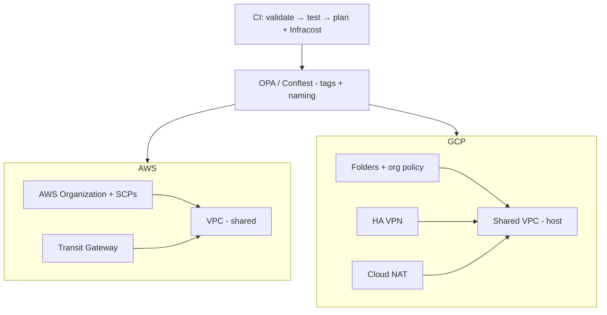

# multi-cloud-landing-zone

[](https://github.com/davidllauce/multi-cloud-landing-zone/actions/workflows/ci.yml)
[](LICENSE)
[](.terraform-version)

A production-grade **landing zone** foundation for AWS and GCP, built as a
single cloud-agnostic control plane with Terraform.

A landing zone is the organization-level foundation — identity, networking,
security, and governance — that every workload builds on. This repository
applies the same foundation across AWS and GCP.

## Architecture



The same Terraform control plane applies the foundation across both providers;
provider-specific resources are used only where the clouds genuinely differ.

## Prerequisites

| Tool | Purpose |
|---|---|
| [`tenv`](https://github.com/tofuutils/tenv) | Terraform version manager (`tenv tf install 1.9.8`) |
| [`uv`](https://github.com/astral-sh/uv) | Python environments |
| [`task`](https://taskfile.dev/) | Task runner |
| `tflint` | Terraform lint |
| `conftest` / `opa` | Policy-as-code (optional, used in CI) |
| [LocalStack](https://localstack.cloud/) | AWS emulation for local runs |
| GCP emulators | BigQuery / Pub/Sub / etc. for local runs |

## Quickstart

```bash
task setup       # uv venv + pre-commit
task check       # fmt + validate + tflint + pytest + conftest
task iac:plan    # terraform plan (dry-run) on the dev-poc environment
task iac:cost    # Infracost estimate (requires INFRACOST_API_KEY)
```

## Usage

Consume a module directly from this repository:

```hcl
module "aws_landing_zone" {
  source = "git::https://github.com/davidllauce/multi-cloud-landing-zone.git//terraform/modules/aws-landing-zone?ref=main"

  region      = "us-east-1"
  environment = "dev"
  team        = "sre"
}

module "gcp_landing_zone" {
  source = "git::https://github.com/davidllauce/multi-cloud-landing-zone.git//terraform/modules/gcp-landing-zone?ref=main"

  project_id  = "my-project"
  region      = "us-central1"
  environment = "dev"
  team        = "sre"
}
```

## Testing

Policy-as-code is enforced by OPA/Conftest (see `ADRs/ADR-001`). Run it locally:

```bash
task iac:policy   # conftest test tests/fixtures/plan_valid.json
task test         # pytest (includes policy checks)
```

## Project layout

```text
terraform/
├── modules/                    # reusable, stateless modules
│   ├── aws-landing-zone/       # org + SCPs, Transit Gateway, shared VPC
│   ├── gcp-landing-zone/       # folders, Shared VPC, HA VPN, Cloud NAT
│   ├── policy/                 # OPA policies (tags + naming)
│   └── backend/                # remote state (S3 / GCS)
└── environments/dev-poc/       # dev environment instance
tests/                          # pytest + policy checks
docs/                           # architecture + SLOs
ADRs/                           # architecture decision records
```

## What is applied vs plan-only

| Layer | AWS | GCP | Mode |
|---|---|---|---|
| Organization / folders / SCPs / org policies | Control Tower + LZA | Fabric FAST folders + org policy | plan-only |
| Networking (VPC / Shared VPC, HA VPN, Cloud NAT) | VPC + Transit Gateway | Shared VPC + HA VPN + NAT | LocalStack / emulator |
| Policy-as-code (tags + naming) | OPA/Conftest | OPA/Conftest | always (tested in CI) |
| Remote state | S3 | GCS | configured (placeholders) |

Org-level resources are modeled in Terraform and verified via `plan`; they
require a real AWS Organization / GCP Organization to apply.

## Decisions

See [`ADRs/`](ADRs/). SLOs in [`docs/slos.yaml`](docs/slos.yaml).
