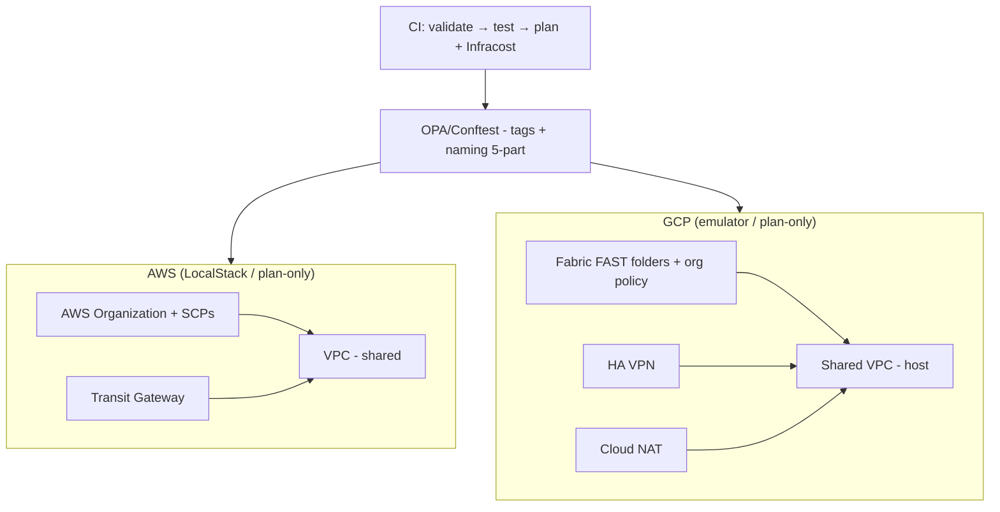

# Landing Zone Architecture

Single cloud-agnostic control plane (Terraform) applying the same foundation
across AWS and GCP.

## Principles

- **Cloud as commodity:** identical OSS control plane (Terraform + OPA) for both
  providers; provider-specific resources only where the cloud genuinely differs.
- **Plan-only for org level:** AWS Organizations/SCPs and GCP folders/org policies
  require real orgs — modeled in Terraform, verified via `plan`, applied only in
  a real account.
- **Policy as code:** every resource must carry `dll-cost-center`, `dll-team`,
  `env` and follow 5-part naming; OPA rejects violations in CI.
